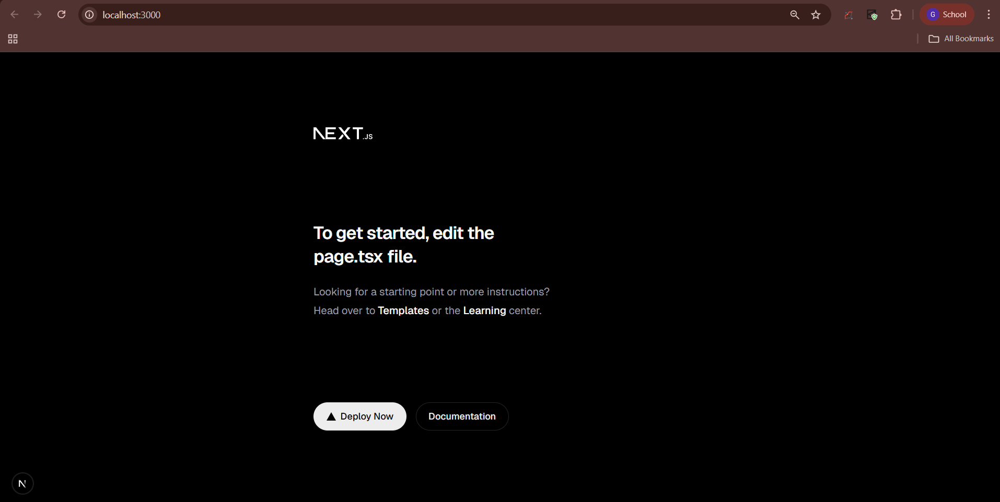

# Climate Dashboard

## 📌 Project Description
The Climate Dashboard is a simple web application built using **Next.js with TypeScript**.  
The problem this project addresses is organizing a modern frontend application in a clean, scalable way so that future features can be added without confusion or rework.

---

## 📁 Folder Structure

src/
├── app/ # Routes, pages, and layouts (App Router)
├── components/ # Reusable UI components
├── lib/ # Utility functions and helper logic


### Folder Explanation

- **app/**
  - Handles routing, pages, layouts, and API routes
  - Uses Next.js App Router for structured navigation

- **components/**
  - Contains reusable UI components
  - Encourages modular and maintainable UI design

- **lib/**
  - Stores utility functions and shared logic
  - Keeps business logic separate from UI components

---

## ⚙️ Setup Instructions

### Installation
```bash
npm install

